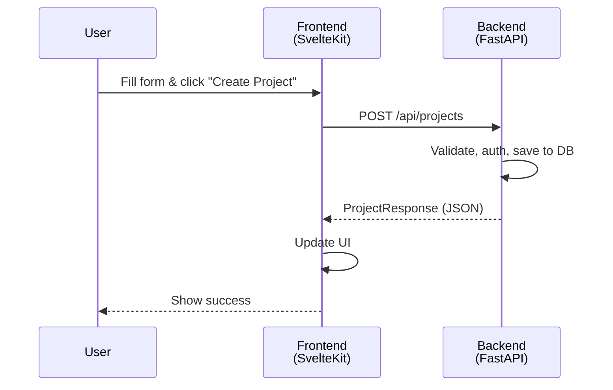
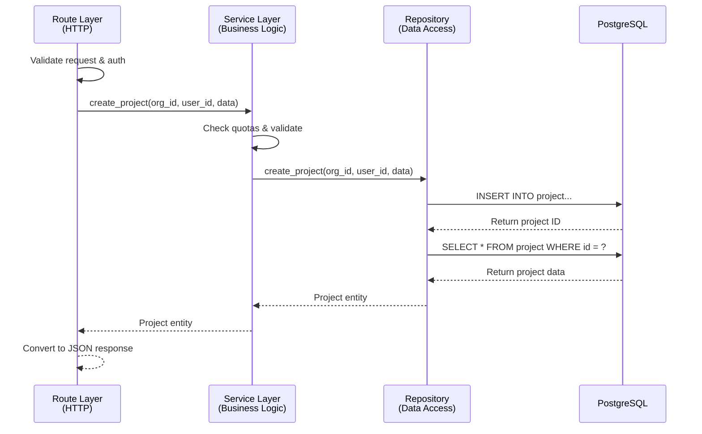

# Architecture

This document explains how [FastSvelte](https://fastsvelte.dev) is structured and the reasoning behind key architectural decisions.

## 1. The Monorepo Structure

FastSvelte has four parts:

```
fastsvelte/
├── backend/          # FastAPI + Python (your API)
├── frontend/         # SvelteKit + TypeScript (admin dashboard)
├── landing/          # SvelteKit (marketing site)
└── backend/db/       # PostgreSQL + Sqitch (database migrations)
```

### Why a monorepo?

FastSvelte uses a monorepo because it's a tightly coupled fullstack application where the backend and frontend are designed to work together. When the backend API changes, the frontend needs to change with it - keeping them in separate repositories would mean managing dependencies, versioning, and synchronization across repos. A monorepo allows atomic commits that update the database schema, backend logic, and frontend UI simultaneously, ensuring the entire system stays in sync. This simplifies development with a single clone and unified tooling.

### Design Philosophy: Minimal Dependencies, Maximum Flexibility

FastSvelte intentionally avoids many popular libraries and frameworks that other starter kits include. Instead of bundling heavy abstractions, it sticks to proven, essential tools with minimal dependencies.

**Why stay lean?** Adding a library later is straightforward - removing one that's baked into the starter kit is painful. As a starter kit, FastSvelte's job is to provide a solid foundation, not to make architectural decisions for you. This approach makes the codebase highly customizable. Build exactly what you need, add libraries as your requirements become clear, and maintain full control over your architecture.

---

## 2. End-to-End Request Flow

Let's trace what happens when a user creates a project in your SaaS app. (This example follows the [Adding a New Entity tutorial](../guides/adding-a-feature.md#adding-a-new-entity-end-to-end) where you build a project management feature.)

### High-Level Flow



**The flow:**

1. **User** fills out a form and clicks "Create Project"
2. **Frontend** sends API request with project data
3. **Backend** validates, authenticates, and saves to database
4. **Response** flows back: backend → frontend → user sees success

That's the high-level flow. Now let's see how each piece is built.

---

## 3. Backend: Layered Architecture

The backend is where all the heavy lifting happens. External services like Stripe, SendGrid, and Google OAuth integrate here. The frontend stays thin - it's purely a presentation layer that talks to the backend API.

The backend separates concerns into layers. Here's how a request flows through them:

### Backend Request Flow



**Each layer has a specific job:**

- **Route** - Handles HTTP (validation, auth, response formatting)
- **Service** - Business logic (quotas, permissions, workflows)
- **Repository** - Database access (SQL queries)
- **Database** - Data storage

### Directory Structure

```
app/
├── main.py              # Starts everything
├── config/              # Settings & dependency injection
├── api/route/           # HTTP endpoints
├── service/             # Business logic
├── data/repo/           # Database queries
├── model/               # Request/response shapes
└── util/                # Auth, email, etc.
```

!!! tip "Keep Layers Separated"
Don't leak concerns between layers. Services shouldn't know about HTTP status codes or request objects. Repositories shouldn't contain business logic.

    **Bad example** - Service returning HTTP exception:
    ```python
    # ❌ Service layer shouldn't know about HTTP
    async def create_user(self, email: str):
        if self.user_repo.exists(email):
            raise HTTPException(status_code=409, detail="User exists")
    ```

    **Good example** - Service throws domain exception, route handles HTTP:
    ```python
    # ✅ Service throws domain exception
    async def create_user(self, email: str):
        if self.user_repo.exists(email):
            raise UserAlreadyExistsException(email)

    # ✅ Route converts to HTTP
    @router.post("/users")
    async def create_user_route(data: UserCreate):
        try:
            return await user_service.create_user(data.email)
        except UserAlreadyExistsException as e:
            raise HTTPException(status_code=409, detail=str(e))
    ```

### Why raw SQL instead of an ORM?

ORMs add complexity. You learn the ORM's query language, debug what SQL it generates, then eventually write raw SQL anyway for performance. With raw SQL in repositories, you see exactly what runs and optimize directly.

Raw SQL is also easier for LLMs to generate and reason about, making AI-assisted development smoother.

Beyond technical considerations, this choice aligns with FastSvelte's [design philosophy](#design-philosophy-minimal-dependencies-maximum-flexibility) of staying lean. Adding an ORM later is straightforward when your project needs it - removing one that's baked into the starter kit is painful. You maintain full control over data access patterns and can choose SQLAlchemy, Prisma, or any other tool based on your actual requirements.

### Why dependency injection?

Dependency injection eliminates repetitive boilerplate and centralizes configuration. Instead of manually constructing dependencies in every route, they're wired up once and injected automatically.

In FastSvelte, all objects are wired up in one place (`app/config/container.py`):

```python
# Define everything once
self.project_repo = providers.Factory(ProjectRepo, db_config=self.db_config)
self.project_service = providers.Singleton(ProjectService, project_repo=self.project_repo)
```

Then use them anywhere:

```python
async def create_project(
    project_service: ProjectService = Depends()  # Injected automatically
):
    ...
```

This centralization provides several benefits. Object lifecycles (singleton vs factory) are explicit and visible in one file - no hunting through the codebase to determine if a service creates new instances or reuses one. Configuration changes propagate automatically without touching route code. Testing becomes straightforward by swapping implementations in the container rather than modifying dozens of files.

---

## 4. Database: Multi-Tenant PostgreSQL

All data is scoped to an **organization** (the tenant boundary), so the schema serves both individual users and teams without changing. Migrations are plain SQL managed with **Sqitch** — no ORM. The mode (`b2c` / `b2b`) is set by `FS_MODE` and changes only application logic, not the schema.

See **[Database](../features/database.md)** for the schema, `db_config`, and the Sqitch workflow, and **[Multi-Tenancy](../features/multi-tenancy.md)** for the organization, role, and invitation model.

---

## 5. Frontend: Type-Safe SvelteKit

The frontend is a SvelteKit SPA (Single Page Application) that stays thin by delegating all business logic to the backend. It uses Svelte 5 runes for reactivity and maintains type safety through auto-generated API clients.

**Directory structure:**

```
src/
├── routes/
│   ├── (auth)/          # Login, signup (public pages)
│   ├── (protected)/     # Dashboard, settings (requires authentication)
│   └── +layout.svelte   # Global layout wrapper
├── lib/
│   ├── api/gen/         # Auto-generated TypeScript API client (Orval)
│   ├── auth/            # Session management with Svelte stores
│   ├── components/      # Reusable UI components
│   ├── context/         # Application-wide context providers
│   ├── config/          # Configuration and constants
│   └── util/            # Helper functions and utilities
```

**Key features:**

- **Route-based authentication**: Routes in `(protected)/` automatically check for valid sessions
- **Auto-generated API client**: TypeScript types generated from OpenAPI spec ensure compile-time safety
- **Svelte 5 runes**: Modern reactivity with `$state`, `$derived`, and `$effect` for local component state
- **TailwindCSS + DaisyUI**: Utility-first styling with pre-built component themes

### Auto-generated API client

The frontend's TypeScript API client is generated from the backend's OpenAPI spec, so a backend change surfaces as a compile-time error in the frontend. See **[Type-Safe API Client (Orval)](../guides/orval.md)**.

---

## 6. Authentication & Security

### Session-based authentication

We use session cookies (not JWT tokens):

1. User logs in → Backend creates session in database
2. Backend sends HTTP-only cookie with session ID
3. Every API call includes this cookie automatically
4. Backend checks: "Is this session valid?" before responding

**Why session cookies instead of JWT?**

- HTTP-only cookies can't be stolen by JavaScript (XSS protection)
- Server controls sessions = instant logout
- Simpler frontend code = no token refresh logic
- Built-in CSRF protection with SameSite cookies

Sessions expire after 24 hours (configurable). The backend stores hashed session tokens and compares them on each request.

### Role-based access control

Four roles, ordered by precedence (`readonly` < `member` < `org_admin` < `sys_admin`):

- **readonly** - View-only access
- **member** - Basic user (can use the app)
- **org_admin** - Manage organization (invite users, change settings)
- **sys_admin** - Full system access (manage all orgs, see analytics)

See [Authentication](../features/authentication.md) and [Security](../features/security.md) for the full model. Protect routes with role checks:

```python
@router.get("/admin/users")
async def list_users(
    current_user: CurrentUser = Depends(min_role_required(Role.SYSTEM_ADMIN))
):
    # Only sys_admins can reach this
```

Routes in `(protected)/` automatically check authentication on the frontend:

```html
<!-- (protected)/+layout.svelte -->
<script>
  import { onMount } from "svelte";
  import { ensureAuthenticated } from "$lib/auth/session";

  onMount(async () => {
    await ensureAuthenticated(); // Redirects to login if not authenticated
  });
</script>
```

---

## 7. Frequently Asked Questions

### Why file name suffixes like `user_service.py`?

Files are named `service/user_service.py` instead of `service/user.py`. The suffix appears redundant since the folder already indicates the layer, but it solves a practical problem.

**Without suffixes:**

```
user.py | user.py | user.py | user.py
```

**With suffixes:**

```
user_route.py | user_service.py | user_model.py | user_repo.py
```

When multiple files are open, IDE tabs show filenames, not full paths. Without suffixes, every tab displays `user.py` - making navigation difficult. The suffix also improves search: typing "user_service" immediately finds the right file instead of filtering through four different `user.py` files across different folders.

### Why `Factory` vs `Singleton` in dependency injection?

**Singleton** = one instance for the whole app:

```python
# Same UserService instance every time
user_service = providers.Singleton(UserService, user_repo=user_repo)
```

**Factory** = new instance each time:

```python
# Fresh UserRepo instance per request
user_repo = providers.Factory(UserRepo, db_config=db_config)
```

Use `Factory` when the component might hold state (like database connections).

Use `Singleton` when it's stateless (like services).

### How does error handling work?

FastSvelte uses domain exceptions that inherit from `BaseAppException`. Each exception knows its own HTTP status code, error code, and message format. A global error handler middleware automatically converts these to JSON responses.

**Services throw domain exceptions:**

```python
from app.exception.common_exception import ResourceNotFound

async def get_user(self, user_id: int):
    user = await self.user_repo.get_by_id(user_id)
    if not user:
        raise ResourceNotFound(resource="user", resource_id=user_id)
    return user
```

**Routes don't need try/catch - exceptions bubble up to middleware:**

```python
@router.get("/{user_id}")
async def get_user_route(user_id: int, user_service: UserService = Depends()):
    # No try/catch needed - middleware handles it
    return await user_service.get_user(user_id)
```

**Middleware automatically converts to HTTP response:**

The global error handler in `app/api/middleware/error_handler.py` catches all `BaseAppException` instances and returns structured JSON responses with the appropriate status code, error code, message, and details.

See [Section 3](#3-backend-layered-architecture) for why services shouldn't know about HTTP - they might be called from routes, background jobs, CLI scripts, or tests.

---

---

**Next Steps:**

- [Development Guide](../guides/development-workflow.md) - Start building
- [B2B Mode](../features/multi-tenancy.md) - Configure team collaboration features
- [Integrations](../features/authentication.md) - Add Stripe, SendGrid, and OAuth
- [Troubleshooting](troubleshooting.md) - Fix issues
